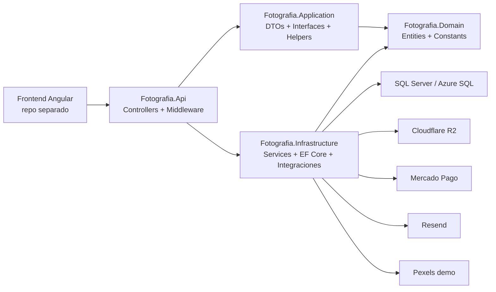
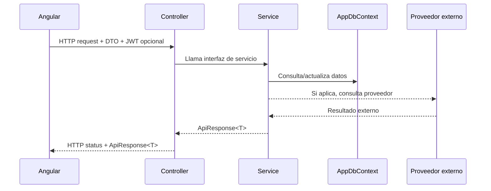
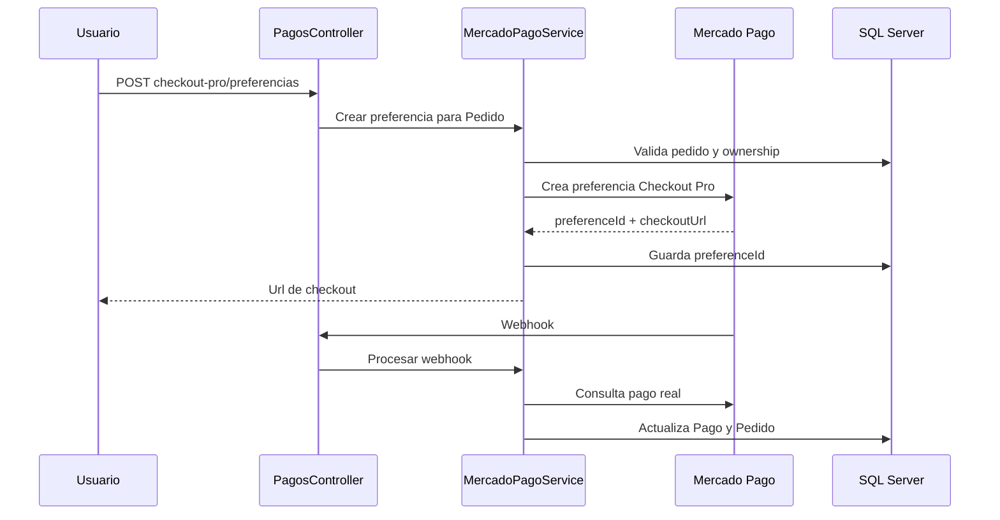
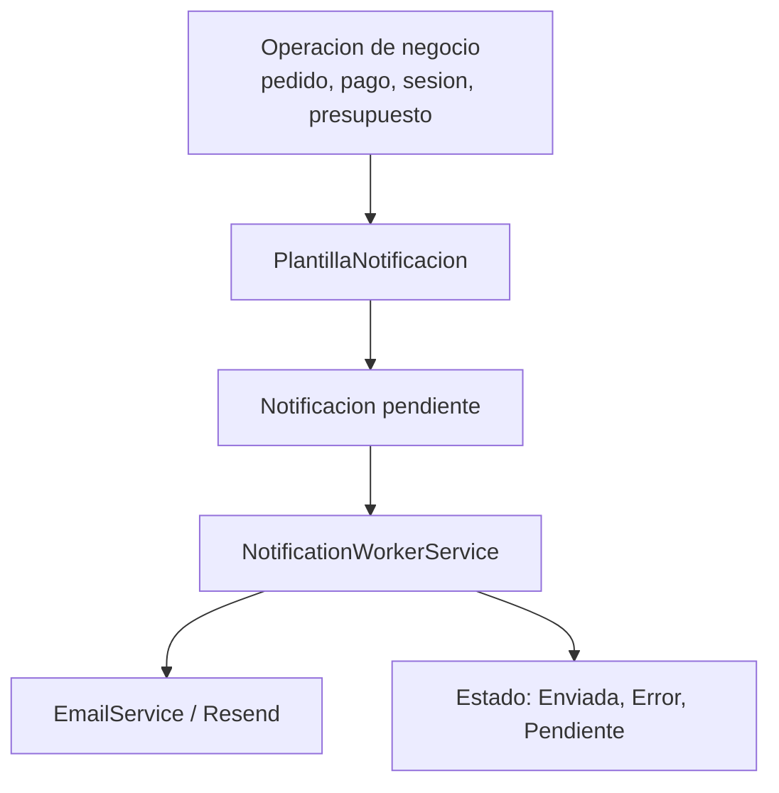
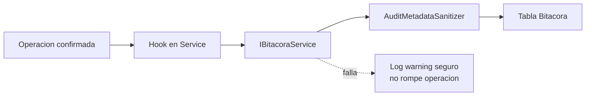

# Arquitectura

Este backend esta organizado como una API ASP.NET Core por capas, con controllers delgados, servicios de aplicacion/dominio, EF Core en Infrastructure y contratos HTTP basados en DTOs. El frontend Angular es externo a este repositorio.

## Vista General

## Capas

### Fotografia.Api

Responsabilidades:

- host ASP.NET Core;
- controllers HTTP;
- Swagger/OpenAPI;
- CORS para frontend Angular externo;
- autenticacion JWT Bearer;
- autorizacion por roles;
- rate limiting;
- health checks;
- middleware de correlation id;
- middleware global de errores.

Los controllers no deberian contener logica de negocio pesada. Su trabajo es recibir DTOs, llamar interfaces de services y transformar `ApiResponse<T>` en resultados HTTP.

### Fotografia.Application

Responsabilidades:

- DTOs de request/response;
- `ApiResponse<T>` y helpers de respuesta;
- interfaces de servicios;
- perfiles AutoMapper;
- helpers compartidos;
- contratos de seguridad compartidos como roles.

Esta capa define lo que la API expone y lo que Infrastructure debe implementar.

### Fotografia.Domain

Responsabilidades:

- entidades del dominio;
- constantes de estados, roles conceptuales, tipos y acciones;
- estructura relacional del negocio.

No depende de EF Core directamente ni de ASP.NET Core.

### Fotografia.Infrastructure

Responsabilidades:

- `AppDbContext` y configuracion EF Core;
- migraciones SQL Server;
- services concretos;
- seed/demo data;
- JWT helper;
- integraciones externas;
- worker de notificaciones;
- Cloudflare R2, Mercado Pago, Resend y Pexels.

EF Core queda concentrado en esta capa. Los services usan `DbContext` como unit of work por scope/request.

## Patrones Usados

- Service Layer: la logica de negocio vive en services como `PedidoService`, `CarritoService`, `DescargaService`, `EventoService` y `BitacoraService`.
- DTO Pattern: controllers reciben y devuelven DTOs, no entidades EF.
- Dependency Injection: dependencies registradas desde `AddApplication` y `AddInfrastructure`.
- Options Pattern: settings tipados para JWT, CORS, base de datos, Pexels, R2, Resend, Mercado Pago y notificaciones.
- BackgroundService: `NotificationWorkerService` procesa notificaciones pendientes.
- Unit of Work: `AppDbContext` coordina cambios, tracking y `SaveChangesAsync`.
- ResourceAccessService: centraliza reglas reutilizables de ownership y visibilidad.
- ApiResponse: envelope compatible con Angular para `success`, `message`, `data`, `errors` y `statusCode`.
- BitacoraService: auditoria operacional tolerante a fallos con metadata sanitizada.

## Por Que No Hay Repository Generico

No se usa repository generico porque EF Core ya provee un repositorio/unit-of-work expresivo con `DbSet<T>` y `DbContext`.

Un repository generico agregaria una abstraccion pobre que:

- ocultaria capacidades utiles de EF Core como `Include`, tracking, transacciones, filtros y proyecciones;
- duplicaria consultas sin aportar reglas de negocio;
- haria mas dificil optimizar queries por caso de uso;
- aumentaria boilerplate en un proyecto que ya tiene services por dominio.

Si en el futuro aparecen consultas complejas repetidas, conviene extraer query services, specifications puntuales o metodos privados reutilizables por aggregate, no un repository generico global.

## Flujo HTTP

El controller no decide reglas de negocio. El service valida permisos, ownership, estado de entidades, reglas de negocio e integraciones.

## Flujo De Errores

- Validaciones: `400 BadRequest`.
- Falta de token: `401 Unauthorized`.
- Token valido sin permiso/ownership: `403 Forbidden`.
- Entidad inexistente: `404 NotFound`.
- Conflictos o duplicados: `409 Conflict` cuando aplica.
- Proveedores externos: `502/503` mediante `ExternalDependency` cuando aplica.
- Error inesperado: middleware global devuelve mensaje seguro con `traceId` y `correlationId`.

`ApiResponse<T>` se mantiene por compatibilidad con el frontend. El middleware global cubre excepciones no controladas y evita filtrar detalles internos.

## Flujo De Pagos

El webhook no deberia confiar solo en el payload recibido: consulta a Mercado Pago antes de actualizar estado local. La auditoria registra resultado local sin guardar tokens ni payload crudo.

## Flujo De Descargas

- El usuario compra una foto, paquete o foto privada.
- El pedido debe estar pagado o en estado que permita descarga.
- `DescargaService` valida ownership.
- Se valida que la foto pertenezca al pedido o a un paquete comprado.
- Cloudflare R2 genera una URL temporal/firmada.
- SQL Server guarda metadata de descarga, contadores y vencimiento.
- No se exponen `StorageKey` ni URLs firmadas en logs o bitacora.

## Flujo De Notificaciones

Los services encolan notificaciones mediante plantillas. El worker procesa en background segun configuracion. El sistema puede desactivar envio automatico en Development.

## Flujo De Auditoria

`BitacoraService` captura:

- usuario, email y rol;
- accion y entidad;
- IP, user agent, ruta y metodo HTTP;
- correlation id;
- severidad;
- metadata operativa sanitizada.

Nunca debe guardar passwords, JWT, API keys, URLs firmadas, `StorageKey`, `MarcaAguaStorageKey` ni payloads crudos de proveedores.

## Seguridad Y Ownership

El backend combina:

- JWT para usuarios autenticados;
- roles para Admin y Usuario;
- endpoints publicos anonimos para Invitado;
- ownership en services;
- sanitizacion de DTOs para no admin;
- links temporales para descargas;
- rate limiting en endpoints publicos sensibles.

`ResourceAccessService` ayuda a mantener reglas consistentes para recursos reutilizados como eventos, fotos y paquetes.

## Reglas De Datos

- SQL Server guarda metadata, relaciones y estado del negocio.
- Las imagenes reales se guardan fuera de SQL, en Cloudflare R2.
- No se usan `byte[]` ni `varbinary(max)` para imagenes.
- Los deletes con historial usan borrado logico.
- No se usa cascade delete peligroso para historiales como pedidos, pagos y descargas.

## Deuda Tecnica Controlada

- Algunos services grandes pueden dividirse cuando haya mas cobertura.
- `ApiResponse<T>` se mantiene por compatibilidad con Angular; se puede convivir con ProblemDetails para errores globales.
- Swashbuckle sigue siendo practico por Swagger UI; migrar a OpenAPI first-party puede evaluarse si aporta valor real.
- Testcontainers con SQL Server seria el siguiente paso para validar migraciones y comportamiento relacional real.
